# Dockerize Frontend, Backend and Postgres services

## Task

Task:
- [Create Backend Dockerfile and build docker image](#backend)
- [Create Frontend Dockerfile and build docker image](#frontend)
- [Create Database Dockerfile and build docker image](#database)
- [Push docker images to docker hub](#push)
- [Deploy functional spring petclinic app using docker containers](#deploy)
- [Add volume to PostgreSQL docker container](#volume)
- [Create Docker network for spring petclinic containers](#network)

## Screenshots

<details>
<summary>Screenshots of task completion</summary>

Images:


Containers:


Network:

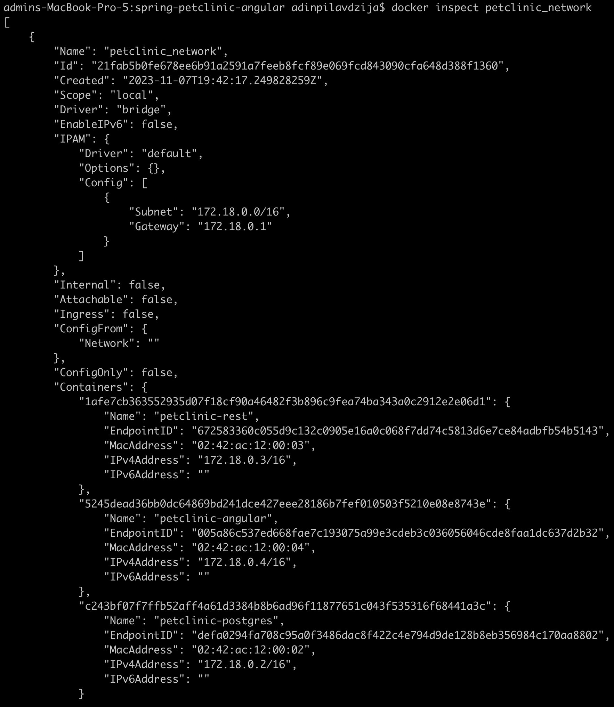

Volume:
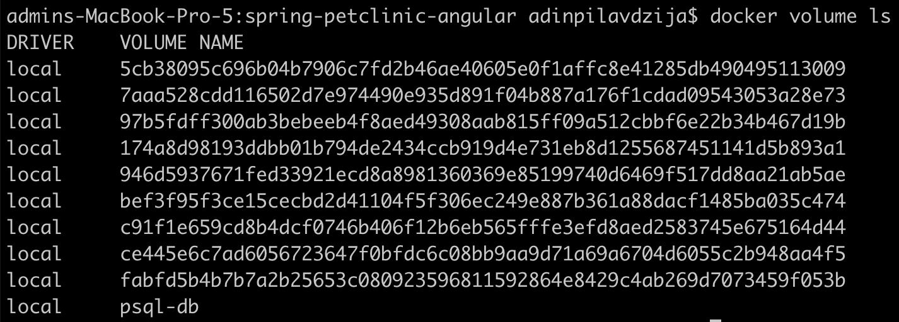

</details>

## Docker cheatsheet

- https://docs.docker.com/get-started/docker_cheatsheet.pdf
- https://spacelift.io/blog/docker-commands-cheat-sheet

Some of the used commands:
```
$ docker rmi -f image-id # command for forced delete of docker image
$ docker logs -tf container-name
$ docker exec -it container-name sh
```

<details>
<summary>Cheatsheets</summary>
	
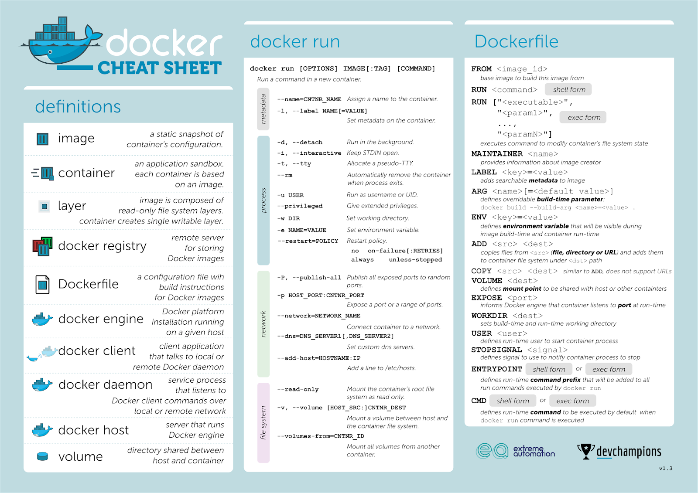
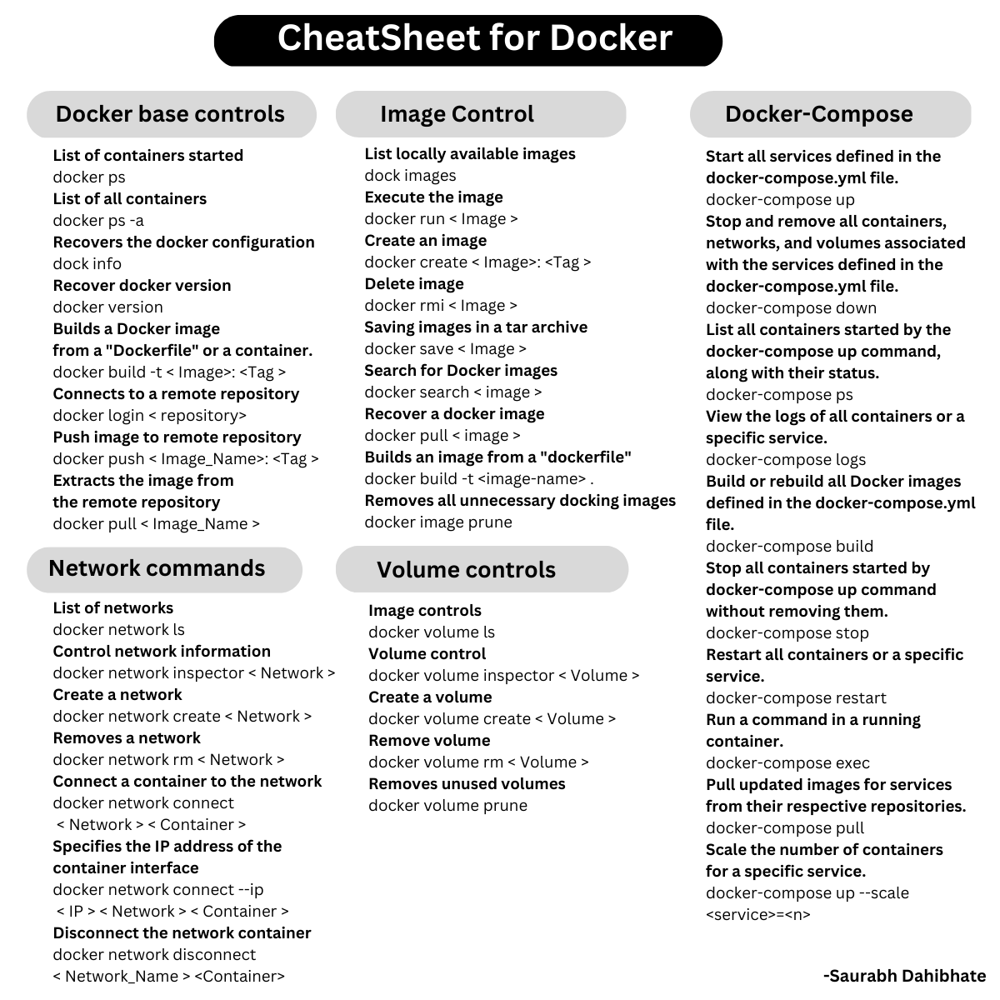
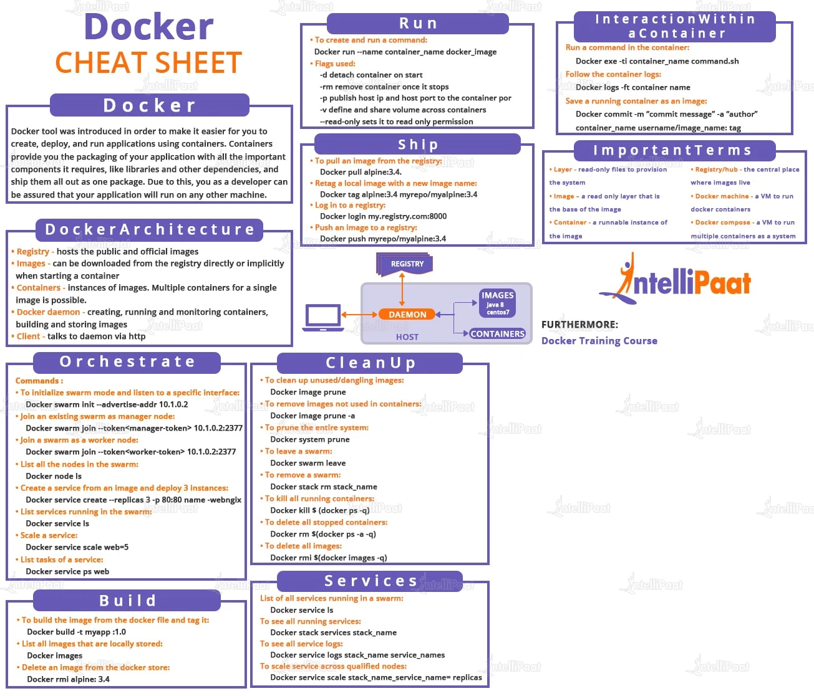
</details>

## Resources

- [Docker Tutorial for Beginners by TechWorld with Nana](https://youtu.be/3c-iBn73dDE?si=CWVZAiVqEFOlDqOE)
- [Top 8 Docker Best Practices for using Docker in Production by TechWorld with Nana](https://youtu.be/8vXoMqWgbQQ?si=b4ELddYANFXogZud)
- [Using Docker Multi-Stage Builds by DevOps Toolkit](https://youtu.be/zpkqNPwEzac?si=HoWLIuuvudPVzfuY)

## Docker

<p align="center">
  
</p>

Docker is an open platform for developing, shipping, and running applications. Docker enables you to separate your applications from your infrastructure so you can deliver software quickly. With Docker, you can manage your infrastructure in the same ways you manage your applications. By taking advantage of Docker's methodologies for shipping, testing, and deploying code, you can significantly reduce the delay between writing code and running it in production.

Docker provides the ability to package and run an application in a loosely isolated environment called a container. The isolation and security lets you to run many containers simultaneously on a given host. Containers are lightweight and contain everything needed to run the application, so you don't need to rely on what's installed on the host. You can share containers while you work, and be sure that everyone you share with gets the same container that works in the same way. The primary benefits of Docker are speed, consistency, density, and portability.

Docker architecture:  


Dockerfile -> Image -> Container:


- **Docker Client** is a component used by a Docker user to interact with the Docker daemon and issue commands. These commands are based on the Docker API.
- **Docker Daemon** runs on a host machine and manages containers, images, networks, and volumes. It receives commands from the Docker client and executes them. The Docker daemon uses Docker images to create containers.
- **Docker Architecture** is made of layers, as we will discuss below. The bottom layer is the physical server that we use to host virtual machines. This is the same as a traditional virtualization architecture. The second layer is the Host OS, which is the base machine (i.e. Windows or Linux). Next, is the Docker Engine, which we use to run the operating system. Above that are the Apps which run as Docker containers. Those Docker Objects are made up of images and containers.
- The basic structure of Docker relies on **images and containers**. We can think of a container as an object and an image as its class.
  - **Container** is an isolated system that holds everything required to run a specific application. It is a specific instance of an image that simulates the necessary environment. 
  - **Images**, on the other hand, are used to start up containers. From running containers, we can get images, which can be composed together to form a system-agnostic way of packaging applications. Images can be pre-built, retrieved from registries, created from already existing ones, or combined together via a common network.
- **Dockerfiles** are how we containerize our application, or how we build a new container from an already pre-built image and add custom logic to start our application. From a Dockerfile, we use the Docker build command to create an image. Think of a Dockerfile as a text document that contains the commands we call on the command line to build an image.
> [!IMPORTANT]
> If you have a file called Dockerfile in the root of your build context it will be automatically picked up. If you need more than one Dockerfile for the same build context, the suggested naming convention is: `Dockerfile.<purpose>`. These dockerfiles could be in the root of your build context or in a subdirectory to keep your root directory more tidy.
- Dockerfile works in **layers**. These are the building blocks of Docker. The first layer starts with the FROM keyword and defines which pre-built image we will use to build an image. We can then define user permissions and startup scripts. In Docker, a container is an image with a readable layer built on top of a read-only layer. These layers are called intermediate images, and they are generated when we execute the commands in our Dockerfile during the build stage.
- **Docker Registry** is a centralized location for storing and distributing Docker images. The most commonly used public registry is **Docker Hub**, but you can also create your own private registry.
- **Docker Hub** is a Docker Registry that provides unlimited storage for public images and offers paid plans for hosting private images. Anybody can access a public image. But to publish and access images on Docker Hub, you must create an account first.

## Docker vs Virtual Machines

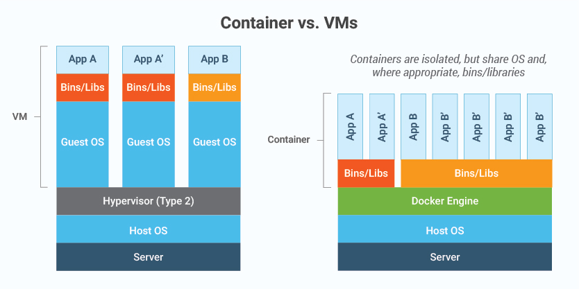

## Create Docker network for spring petclinic containers <a name="network"></a>

By default, Docker uses a bridge network with a subnet like 172.17.0.0/16 and a gateway like 172.17.0.1 for containers to communicate with the host and other containers on the same network. We can create our custom network, for example:

```
docker network create petclinic-network
```

Docker automatically assign a subnet (`172.18.0.0/16`) and gateway (`172.18.0.1`) to the network if not specified. 

Use `--network petclinic-network` with `run` command when creating a container or connect a running container to a network with `docker network connect multi-host-network container1`. For example: `docker network connect petclinic-network petclinic-rest`

## Add volume to PostgreSQL docker container <a name="volume"></a>

The purpose of using Docker volumes is to persist data outside the container so it can be backed up or shared. Docker volumes are dependent on Docker's file system and are the preferred method of persisting data for Docker containers and services.

There are three types of volumes: anonymous, named, and host. Docker manages both anonymous and named volumes, automatically mounting them in self-generated directories in the host. While anonymous volumes were useful with older versions of Docker (pre 1.9), **named ones are now the suggested way to go**. Host volumes also allow us to specify an existing folder in the host.

We can configure host volumes at the service level, and named volumes in the outer level of the configuration, in order to make the latter visible to other containers, rather than only to the one they belong. Multiple containers can use the same volume in the same time period. This is useful if two containers need access to shared data. For example, if one container writes and the other reads the data. Volume names must be unique among drivers. This means you cannot use the same volume name with two different drivers.

It is not required to first create volume: `docker volume create [OPTIONS] [VOLUME]`. You can also specify e.g. `-v psql-db:/var/lib/postgresql/data` it in `docker run` command:
```
docker run -d -p 5432:5432 --network petclinic-network -v psql-db:/var/lib/postgresql/data --name petclinic-postgres petclinic-postgres
```

## Create Database Dockerfile and build docker image <a name="database"></a>

[Database Dockerfile](/00-spring-petclinic-deployment/postgres/Dockerfile) 

Use following commands to build image and run container:
```
$ docker build -t petclinic-postgres .
$ docker run -d -p 5432:5432 --network petclinic-network -v psql-db:/var/lib/postgresql/data --name petclinic-postgres petclinic-postgres
```
> When mounting a volume to /var/lib/postgresql, the /var/lib/postgresql/data path is a local volume from the container runtime, thus data is not persisted on the mounted volume. This optional variable can be used to define another location - like a subdirectory - for the database files. The default is /var/lib/postgresql/data. If the data volume you're using is a filesystem mountpoint (like with GCE persistent disks), or remote folder that cannot be chowned to the postgres user (like some NFS mounts), or contains folders/files (e.g. lost+found), Postgres initdb requires a subdirectory to be created within the mountpoint to contain the data.

> [!TIP]
> Add `POSTGRES_PASSWORD` and `POSTGRES_DB` as `ARG` instead of `ENV` for this Dockerfile. This way, we can provide these 2 variables during `docker build` which gives us more flexibillity while building image to change credentials using [`--build-arg`](https://docs.docker.com/build/guide/build-args/).

## Create Backend Dockerfile and build docker image <a name="backend"></a>

[Backend Dockerfile](../00-spring-petclinic-deployment/spring-petclinic-rest/Dockerfile)

Update the `datasource.url` in `application.properties` file or `.env` file. We can find container's IPV4 address with `docker inspect network-name`. Instead of `localhost`, use IPv4 address or hostname of the database container:
`spring.datasource.url=jdbc:postgresql://localhost:5432/petclinic`
`spring.datasource.url=jdbc:postgresql://172.18.0.2:5432/petclinic`

The location of a `.jar` file can vary, but it's often found in the project's `target` directory: `/target/spring-petclinic-rest-3.0.2.jar`. Another location (`/Users/user/.m2/repository/org/springframework/samples/spring-petclinic-rest/3.0.2/spring-petclinic-rest-3.0.2.jar`) can be found in `pom.xml` file with name and version in adition:
```xml
<groupId>org.springframework.samples</groupId>
<artifactId>spring-petclinic-rest</artifactId>
<version>3.0.2</version>
```

<details>
<summary>Error</summary>

`Error: ... has been compiled by a more recent version of the Java Runtime (class file version 61.0), this version of the Java Runtime only recognizes class file versions up to 55.0`

```
58 = Java 14
59 = Java 15
60 = Java 16
61 = Java 17
62 = Java 18
63 = Java 19
64 = Java 20
65 = Java 21
```

The base image must be at least version 17.
</details>

Use following commands to build image and run container:
```
$ docker build -t petclinic-rest .
$ docker run --env-file .env -d -p 9966:9966 --network petclinic-network --name petclinic-rest petclinic-rest
```

### Size comparison of docker images

Size comparison of docker images based on image used in second stage of [Backend Docker File](../spring-petclinic-rest/Dockerfile):
- 467MB: eclipse-temurin:17
- 375MB: eclipse-temurin:17-alpine
- 237MB: eclipse-temurin:17-jre-alpine

<details>
<summary>Chart</summary>
 
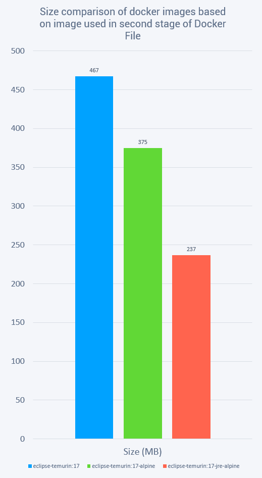
</details>

## Create Frontend Dockerfile and build docker image <a name="frontend"></a>

[Frontend Dockerfile](/00-spring-petclinic-deployment/spring-petclinic-angular/Dockerfile)

> [!TIP]
> When copying multiple files, it is recommended to reference destination as directory like `./` instead of just `.`. `.` represents current directory iteself, while `./` represents current directory as part of a file path.

Create `default.conf` file for nginx configuration and use it in Dockerfile: 
```
server {
	listen       80 default_server;
        root         /usr/share/nginx/html/petclinic;
        index index.html;

	location /petclinic/ {
                alias /usr/share/nginx/html/petclinic/;
                try_files $uri$args $uri$args/ /petclinic/index.html;
        }
}
```

Use following commands to build image and run container:
```
$ docker build -t petclinic-angular .
$ docker run -d -p 4200:80 --network petclinic-network --name petclinic-angular petclinic-angular
```

## Deploy functional spring petclinic app using docker containers <a name="deploy"></a>

As previously mentioned, it is important to highlight the significance of configuring the correct value for `spring.datasource.url`.

<details>
<summary>Screenshots</summary>

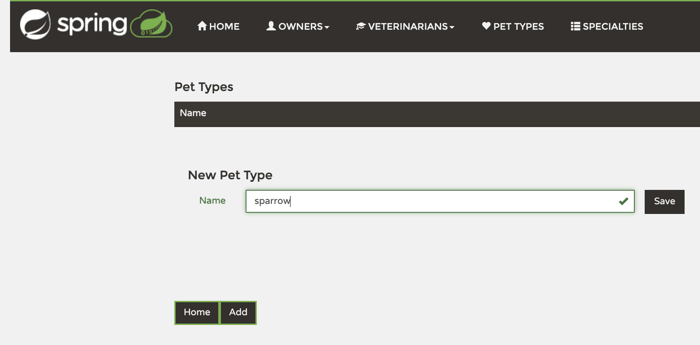

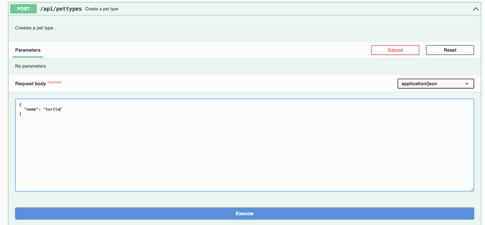
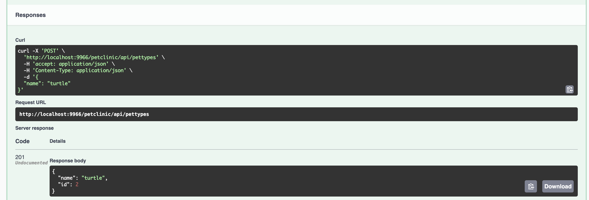
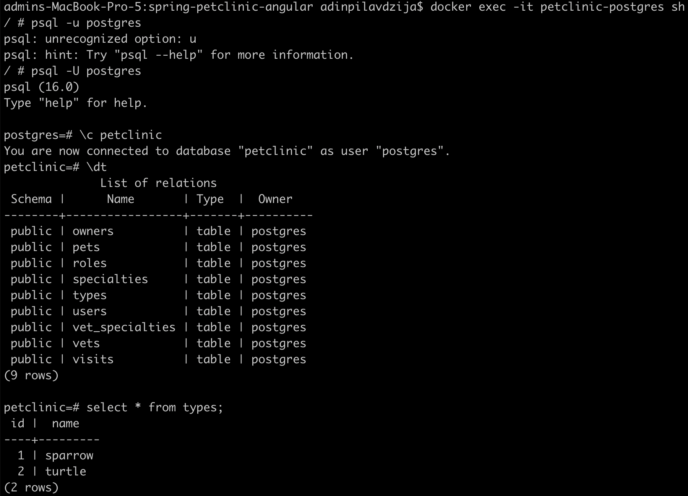

</details>

## Push docker images to docker hub <a name="push"></a>

Links for my Docker images:
- https://hub.docker.com/r/adinpilavdzija/petclinic-postgres
- https://hub.docker.com/r/adinpilavdzija/petclinic-rest
- https://hub.docker.com/r/adinpilavdzija/petclinic-angular

1. Login to DockerHub: `docker login -u <username>`.
2. Tag image with the Docker Hub repository name. The basic syntax is: `docker tag <local_image_name> <docker_hub_username>/<repository_name>:<tag>`
  - `<local_image_name>` is the name of the Docker image you want to push.
  - `<docker_hub_username>` is your Docker Hub username.
  - `<repository_name>` is the name you want to give to the image on Docker Hub.
  - `<tag>` is an optional tag for versioning (e.g., latest, v1.0, etc.).
3. Push image to Docker Hub using the docker push command: `docker push <docker_hub_username>/my_repository:latest`. Replace `<docker_hub_username>` and `<repository_name>` with your Docker Hub username and the repository name you used in the tag.

For example:
```
$ docker tag postgres adinpilavdzija/petclinic-postgres:1.0
$ docker push adinpilavdzija/petclinic-postgres:1.0

$ docker tag petclinic-rest adinpilavdzija/petclinic-rest:1.0
$ docker push adinpilavdzija/petclinic-rest:1.0

$ docker tag petclinic-angular adinpilavdzija/petclinic-angular:1.0
$ docker push adinpilavdzija/petclinic-angular:1.0
```

Pull images from Docker Hub.
```
docker pull adinpilavdzija/petclinic-postgres:1.0
docker pull adinpilavdzija/petclinic-rest:1.0
docker pull adinpilavdzija/petclinic-angular:1.0
```

## Image-building best practices

- **Use Official and Verified Docker Images as Base Image**: Start your Docker image with an official and verified base image provided by the software or service you are using. Official images are maintained and regularly updated, which can help ensure security and reliability.
- **Use Specific Docker Image Versions**: Avoid using the "latest" tag for base images. Using an unspecified tag is equivalent to selecting the 'latest' version. Specify the exact version of the image you want to use. This ensures consistency in your builds and prevents unexpected updates that might break your application.
- **Use Small-Sized Official Images**: Whenever possible, choose official base images that are small in size. Smaller images are faster to download, deploy, and use, which can improve overall system performance and security.
- **Optimize Caching Image Layers**: Be mindful of the order in which you add files and dependencies to your Docker image. Docker can cache layers during the build process, so it's important to add frequently changing components last to maximize the use of cached layers.
- **Use `.dockerignore` File**: Create a .dockerignore file to specify which files and directories should be excluded from the Docker build context. This reduces the size of the context and speeds up the build process.
- **Make Use of Multi-Stage Builds**: Multi-stage builds allow you to use one set of instructions to build dependencies and another set to create the final image. This can result in smaller final images that only include the necessary components.
- **Use the Least Privileged User**: When defining a user in your Dockerfile, use the principle of least privilege. Do not run your application as the root user in the container, as this can pose security risks. Instead, create and use a non-root user for your application.
- **Scan Your Images for Security Vulnerabilities**: Use container scanning tools like Clair, Trivy, or Docker Security Scanning to regularly scan your Docker images for known vulnerabilities. This helps you identify and mitigate security risks in your containers.

Discover more best practices on this [link](https://sysdig.com/blog/dockerfile-best-practices/).
