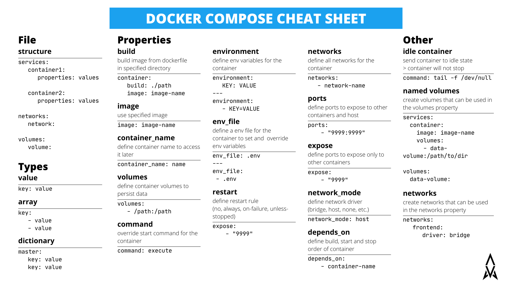

# Create docker-compose file for spring petclinic app

## Task

Task: Create docker-compose file for spring petclinic app -> [docker-compose.yml](../docker-compose.yml)

## Resources

- [Docker Tutorial for Beginners [FULL COURSE in 3 Hours] by TechWorld with Nana](https://youtu.be/3c-iBn73dDE?si=CWVZAiVqEFOlDqOE)
- [Compose file version 3 reference](https://docs.docker.com/compose/compose-file/compose-file-v3/)
- [Docker Compose Tutorial: advanced Docker made simple](https://www.educative.io/blog/docker-compose-tutorial)
- [Docker Compose - Simplilearn](https://www.simplilearn.com/tutorials/docker-tutorial/docker-compose)    

## Docker-compose cheatsheet 

## Docker-compose

**Docker Compose** is a tool for defining and running multi-container Docker applications. With Compose, you can create a YAML file to define the services and with a single command, you can spin everything up or tear it all down.

The big advantage of using Compose is you can define your application stack in a file, keep it at the root of your project repository (it's now version controlled), and easily enable someone else to contribute to your project. Someone would only need to clone your repository and start the app using Compose.

Using Docker Compose is a **three-step process**:
1. Define your app's environment with a `Dockerfile` so it can be reproduced anywhere.
2. Define the services that make up your app in `docker-compose.yml` so they can be run together in an isolated environment.
3. Run `docker compose up` and Compose will start and run your entire app.

Compose works in all environments; production, staging, development, testing, as well as CI workflows. It also has commands for managing the whole lifecycle of your application:
- Start, stop, and rebuild services
- View the status of running services
- Stream the log output of running services
- Run a one-off command on a service

**Benefits of Docker Compose**
- Single host deployment - This means you can run everything on a single piece of hardware
- Quick and easy configuration - Due to YAML scripts
- High productivity - Docker Compose reduces the time it takes to perform tasks
- Security - All the containers are isolated from each other, reducing the threat landscape

## Docker Compose vs Docker Swarm

The difference is that **Docker Compose** is used for configuring multiple containers in the same host, while **Docker Swarm** is a container orchestration tool and it lets you connect containers to multiple hosts similar to *Kubernetes*. **Docker Compose** uses YAML file to manage different containers as a single service, while **Docker Swarm** doesn't use any file but helps you to manage different Docker hosts in a cluster. 

## Installation

For using Docker Compose on macOS and Windows, we need to just have **Docker Desktop** for Mac/Windows installed and don’t need to install Docker Compose separately. To run Docker Compose on Linux, follow [installation process](https://docs.docker.com/compose/install/linux/).

## YAML

**YAML (YAML ain’t markup language)** is a human-readable data serialization language that is often used for writing configuration files. YAML is a popular programming language because it is designed to be easy to read and understand. It can also be used in conjunction with other programming languages. YAML files use a .yml or .yaml extension, and follow specific syntax rules. 

Useful tools are [YAML Cheat Sheet & Quick Reference](https://quickref.me/yaml.html) and [YAML Checker](https://yamlchecker.com/) for validating syntax of YAML files.

## Docker Compose file structure

  
Docker Compose files work by applying multiple commands or keywords that are declared within a single `docker-compose.yml` configuration file. Some of the keywords:
- `version ‘3’`: This denotes that we are using version 3 of Docker Compose, and Docker will provide the appropriate features. At the time of writing this article, version 3.7 is latest version of Compose.
- `services`: This section defines all the different containers we will create.
- `petclinic-postgres`: This is the name of our PostgreSQL service. Docker Compose will create containers with the name we provide.
- `build`: Configuration options that are applied at build time. `build` can be specified either as a string containing a path to the build context or, as an object with the path specified under context and optionally Dockerfile and args.
- `image`: If we don’t have a Dockerfile and want to run a service using a pre-built image, we specify the image location using the image clause. Compose will fork a container from that image.
- `ports`: This is used to map the container’s ports to the host machine.
- `volumes`: This is just like the -v option for mounting disks in Docker. 
- `networks`: Networks to join.
- `links`: This will link one service to another. For the bridge network, we must specify which container should be accessible to which container using links.
- `environment`: The clause allows us to set up an environment variable in the container. This is the same as the -e argument in Docker when running a container.
- `env_file`: Add environment variables from a file. Can be a single value or a list. Environment variables declared in the `environment` section override these values – this holds true even if those values are empty or undefined.
- `depends_on`: Express dependency between services. Services start in dependency order.
