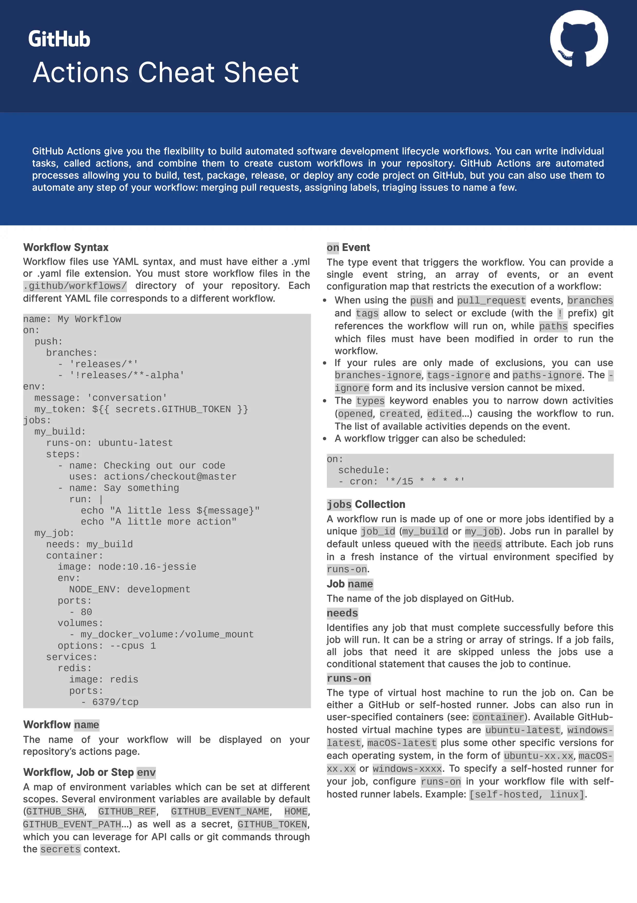
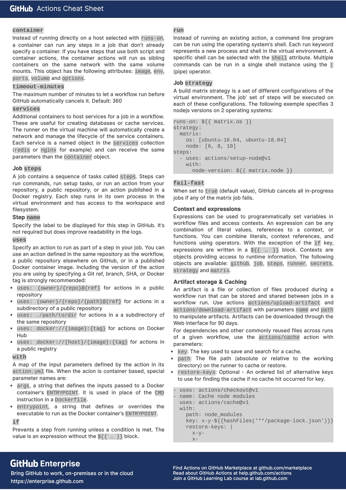
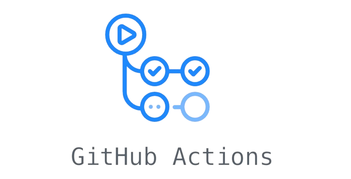

# Create GitHub Actions trigger

## Task

Task: 
- GitHub Actions on Pull Request -> [pull_request.yml](../.github/workflows/pull_request.yml), [in-depth explanation](#workflow-for-github-actions---pull-request-subtask)
  - Trigger on each Pull Request on develop branch
  - Validate the build is successfull
- GitHub Actions on merge -> [merge.yml](../.github/workflows/merge.yml), [in-depth explanation](#workflow-for-github-actions---merge-subtask)
  - Local GitHub runner
  - Build applications
  - Build docker images with appropriate tags
  - Deploy docker-compose 

## Resources

- [Understanding GitHub Actions](https://docs.github.com/en/actions/learn-github-actions/understanding-github-actions)
- [GitHub Actions Tutorial by TechWorld with Nana](https://youtu.be/R8_veQiYBjI?si=vDqI9RRR_nDWtjYG)

## Cheatsheet

[Actionlint playground](https://rhysd.github.io/actionlint/) - Static checker for GitHub Actions workflow files

<details>
<summary>Github Actions Cheatsheet</summary>

[Github Actions Cheatsheet PDF](https://github.github.io/actions-cheat-sheet/actions-cheat-sheet.pdf)



</details>

## GitHub Actions

<p align="right">
    
</p>

GitHub Actions is a continuous integration and continuous delivery (CI/CD) platform that allows you to automate your build, test, and deployment pipeline. You can create workflows that build and test every pull request to your repository, or deploy merged pull requests to production.

GitHub Actions goes beyond just DevOps and lets you run workflows when other events happen in your repository. For example, you can run a workflow to automatically add the appropriate labels whenever someone creates a new issue in your repository.

GitHub provides Linux, Windows, and macOS virtual machines to run your workflows, or you can host your own self-hosted runners in your own data center or cloud infrastructure.

## The components of GitHub Actions

- **Workflow** - configurable automated process that will run one or more jobs. Workflows are defined by a YAML file checked in to your repository and will run when triggered by an event in your repository, or they can be triggered manually, or at a defined schedule. Workflows are defined in the `.github/workflows` directory in a repository, and a repository can have multiple workflows, each of which can perform a different set of tasks.
- **Event** - specific activity in a repository that triggers a workflow run. For example, activity can originate from GitHub when someone creates a pull request, opens an issue, or pushes a commit to a repository. You can also trigger a workflow to run on a schedule, by posting to a REST API, or manually.
- **Job** - set of steps in a workflow that is executed on the same runner. Each step is either a shell script that will be executed, or an action that will be run. Steps are executed in order and are dependent on each other. Since each step is executed on the same runner, you can share data from one step to another.
- **Action** - custom application for the GitHub Actions platform that performs a complex but frequently repeated task. Use an action to help reduce the amount of repetitive code that you write in your workflow files.
- **Runner** - server that runs your workflows when they're triggered. Each runner can run a single job at a time. GitHub provides Ubuntu Linux, Microsoft Windows, and macOS runners to run your workflows; each workflow run executes in a fresh, newly-provisioned virtual machine. If you need a different operating system or require a specific hardware configuration, you can host your own runners.

## Create a workflow 

1. In your repository, create the `.github/workflows/` directory to store your workflow files.
2. In the `.github/workflows/` directory, create a new file called e.g. `my-workflow.yml` and add the code.
3. Commit these changes and push them to your GitHub repository.

Your new GitHub Actions workflow file is now installed in your repository and will run automatically when triggered.

## Understanding the workflow file

### Workflow for Github Actions - Pull request Subtask

<details>
<summary>`pull_request.yml` file with in-depth explanation:</summary>

```yml
# Optional - The name of the workflow as it will appear in the "Actions" tab of the GitHub repository. If this field is omitted, the name of the workflow file will be used instead.
name: Validate Pull Request on Develop

# Specifies the trigger for this workflow. This example uses the `pull_request` event, so a workflow run is triggered every time someone makes pull request to `develop` branch.
on:
  pull_request:
    branches: 
      - develop

# Groups together all the jobs that run in this workflow.
jobs:
  # Defines a job named `backend-build`. The child keys will define properties of the job.
  backend-build:
    name: Backend Build and Test
    # Configures the job to run on the latest version of an Ubuntu Linux runner. This means that the job will execute on a fresh virtual machine hosted by GitHub.
    runs-on: ubuntu-latest
    # Defines defaults for the steps within this job. 
    defaults:
       run:
         # The `working-directory` specifies the path where subsequent commands within the steps should execute.
         working-directory: ./00-spring-petclinic-deployment/spring-petclinic-rest/

    # Groups together all the steps that run in this  job. Each item nested under this section is a separate action or shell script.     
    steps:
      # The `uses` keyword specifies that this step will run `v4` of the `actions/checkout` action. This is an action that checks out your repository onto the runner, allowing you to run scripts or other actions against your code (such as build and test tools). You should use the checkout action any time your workflow will use the repository's code.
      - name: Check out repository     
        uses: actions/checkout@v4
        
      # Uses the `actions/setup-java@v3` action to set up Java Development Kit (JDK) version 17.
      - name: Set up JDK 17
        uses: actions/setup-java@v3
        # The "with" keyword is used to specify input parameters or configuration options for a particular action.
        with:
          java-version: '17'
          distribution: 'temurin'
          cache: maven

      # The `run` keyword tells the job to execute a command on the runner.     
      - name: Build with Maven
        run: mvn test

  frontend-build:
    name: Frontend Build and Test
    runs-on: ubuntu-latest
    
    defaults:
       run:
         working-directory: ./00-spring-petclinic-deployment/spring-petclinic-angular/

    steps:
      - name: Check out repository       
        uses: actions/checkout@v4
        
      # This step uses the `actions/setup-node@v3` action to install the specified version of the Node.js. This puts both the `node` and `npm` commands in your `PATH`.  
      - name: Use Node.js 
        uses: actions/setup-node@v3
        with:
          node-version: 20.9.0
          cache: 'npm'
          cache-dependency-path: './00-spring-petclinic-deployment/spring-petclinic-angular/package-lock.json'

      - name: Install Dependencies
        run: npm ci
        
      - name: Build
        run: npm run build --prod
        
      - name: Test
        run: npm run test-headless
```
</details>

### Secrets

`merge.yml` workflow uses Github Actions secrets. Secrets are variables that you create in an organization, repository, or repository environment. The secrets that you create are available to use in GitHub Actions workflows. GitHub Actions can only read a secret if you explicitly include the secret in a workflow.  
Steps to add a secret: `(Repo's) Settings -> Security -> Secrets and variables -> Actions -> Secrets tab -> New repository secret -> Name field: type a name for your secret -> Secret field: enter the value for your secret -> Add secret`.

### Self-hosted runner

A self-hosted runner is a system that you deploy and manage to execute jobs from GitHub Actions. Self-hosted runners offer more control of hardware, operating system, and software tools than GitHub-hosted runners provide. With self-hosted runners, you can create custom hardware configurations that meet your needs with processing power or memory to run larger jobs, install software available on your local network, and choose an operating system not offered by GitHub-hosted runners. Self-hosted runners can be physical, virtual, in a container, on-premises, or in a cloud.  
Steps to add a self-hosted runner: `(Repo's) Settings -> Actions -> Runners -> New self-hosted runner -> Choose Runner image and architecture -> Execute commands for download -> Execute commands for configure -> Use your self-hosted runner in a YAML workflow file`.

### Workflow for Github Actions - Merge Subtask

> [!IMPORTANT]
> Before merging a branch into the develop branch, it's necessary to perform a Docker login on the local machine. 

- First solution: use `closed` type of `pull_request` event trigger and `if merged` condition
- Second solution: use `push` event trigger in combination with `Branch protection rule "Require a pull request before merging"` (already in use)

While the first solution triggers the GitHub action upon the closure of a pull request, even if it remains unmerged which is resulting in skipped jobs, the second solution only activates the GitHub action when the pull request is successfully merged.

An example showcasing the use of the first solution:
```yml
# Specifies the trigger for this workflow. This example uses the `closed` type of the `pull_request` event to the `develop` branch. It is used in combination with `if: github.event.pull_request.merged == true` down below, so only successfully merged pull request trigger this workflow.
on:
  pull_request:
    types: closed
    branches: 
      - develop

jobs:
  backend:
    # This condition checks if the pull request has been merged. The rest of the job will execute only if this condition evaluates to true.
    if: github.event.pull_request.merged == true
```

<details>
<summary>`merge.yml` file with in-depth explanation:</summary>

```yml
name: Build and Push Docker Images on Develop Merge

# Specifies the trigger for this workflow. This example uses the `push` event to the `develop` branch. It is used in combination with `Branch protection rule "Require a pull request before merging"`, so only successfully merged pull request trigger this workflow (without direct commits to the `develop` branch).
on:
  push:
    branches: 
      - develop

jobs:
  backend:
    name: Backend Build and Push Image
    # Indicates that the workflow will execute on infrastructure managed and hosted by the user rather than on GitHub's servers. This allows for custom hardware configurations, specific software setups, or enhanced security measures tailored to individual needs.
    runs-on: self-hosted
    defaults:
       run:
         working-directory: ./00-spring-petclinic-deployment/spring-petclinic-rest/
    # The 'outputs' section is used to define and store data produced by a job or a specific step within a job. These outputs can then be used elsewhere in the workflow or accessed by subsequent jobs.     
    outputs:
      # The value of the variable 'sha_short' is assigned from the output of a step named 'sha_step'.
      sha_short: ${{ steps.sha_step.outputs.sha_short }}
      
    steps:
      - name: Check out repository     
        uses: actions/checkout@v4

      # This step retrieves the short commit SHA (hash) using 'git rev-parse --short HEAD' command. The output of this step is stored as 'sha_short' and saved to a special GitHub variable '$GITHUB_OUTPUT', making it available for use in subsequent steps or jobs within the workflow.
      - name: Git Short Commit SHA Extraction
        id: sha_step
        run: echo "sha_short=$(git rev-parse --short HEAD)" >> $GITHUB_OUTPUT
          
      # This step uses the 'docker/build-push-action@v5' GitHub Action to build and push Docker images.    
      - name: Build and push Docker images
        uses: docker/build-push-action@v5
        with:
          context: ./00-spring-petclinic-deployment/spring-petclinic-rest/
          push: true
          tags: |
            ${{ secrets.DOCKER_USERNAME }}/spring-petclinic-rest:${{ steps.sha_step.outputs.sha_short }}
            ${{ secrets.DOCKER_USERNAME }}/spring-petclinic-rest:latest

  frontend:
    name: Frontend Build and Push Image
    # This line specifies a dependency relationship within a GitHub Actions workflow. The current job requires that another job named 'backend' has completed before it can start.
    needs: backend
    runs-on: self-hosted
    defaults:
       run:
         working-directory: ./00-spring-petclinic-deployment/spring-petclinic-angular/

    steps: 
      - name: Check out repository       
        uses: actions/checkout@v4

      - name: Build and push Docker images
        uses: docker/build-push-action@v5
        with:
          context: ./00-spring-petclinic-deployment/spring-petclinic-angular/
          push: true
          # `secrets.DOCKER_USERNAME` refers to a secret stored in the repository's secrets settings. DOCKER_USERNAME is a secret key that holds the username or identifier used for authentication with the Docker Hub.
          tags: | 
            ${{ secrets.DOCKER_USERNAME }}/spring-petclinic-angular:${{ needs.backend.outputs.sha_short }}
            ${{ secrets.DOCKER_USERNAME }}/spring-petclinic-angular:latest

  docker-compose:
    name: Docker Compose
    needs: [backend, frontend]
    runs-on: self-hosted

    steps:
      - name: Check out repository       
        uses: actions/checkout@v4

      - name: Docker Compose
        run: docker compose -f ./00-spring-petclinic-deployment/docker-compose.yml up -d
```
</details>

## Security: Best Practices

[GitHub Actions - Security Best Practices](https://blog.gitguardian.com/github-actions-security-cheat-sheet/)

- **Use minimally scoped credentials,** in particular, make sure the GITHUB\_TOKEN is configured with the least privileges to run your jobs.
- **Use specific version tags** to shield yourself from supply-chain compromise of third-party actions.
- **Never store any API key, token, or password in plaintext** (use GitHub Secrets). Use the [ggshield-action](https://github.com/GitGuardian/ggshield-action?ref=blog.gitguardian.com) to implement secrets detection with remediation in your CI workflows.
- **Don’t reference directly values that you don’t control**: it’s all too easy for a malicious PR to inject code. Rather, use an action with arguments, or bind the value to an environment variable.
- **Be extra careful when using self-hosted runners**: preferably, don’t use this option for open source repositories or require approval for all external submissions to run workflows. It’s your responsibility to harden the virtual machines used by the runners, so configure them to use a low-privileged user, be as ephemeral as possible, and instrument the adequate logging and monitoring tools.
- **Don’t check out external PRs when using the ‘pull\_request\_target event’**: a malicious PR could abuse any of your build steps/secrets to compromise your environment.
- **Prefer using OpenID Connect instead of long-lived secrets** to allow your workflows to interact with cloud resources.
