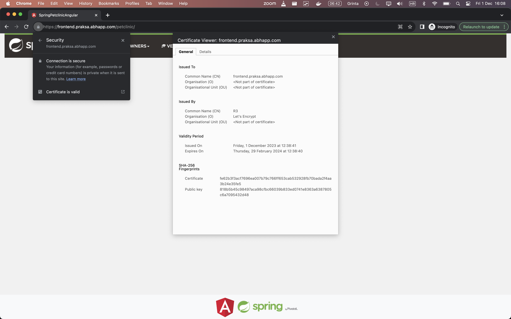
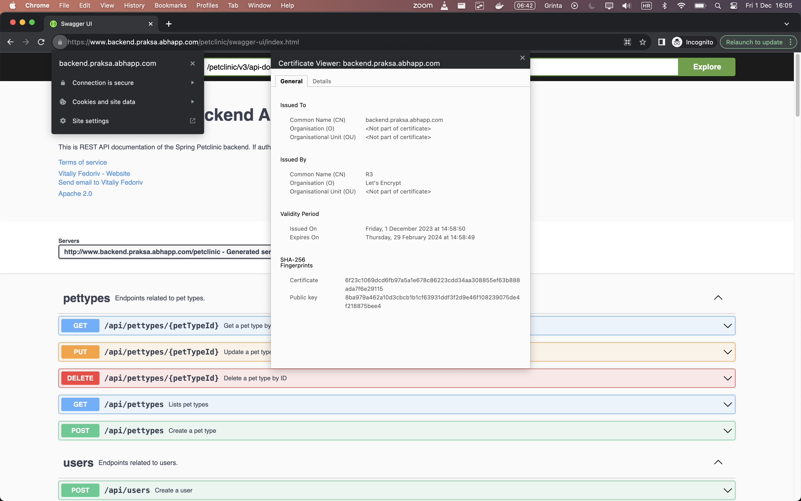

# Migrate local docker-compose to internship server

## Task

Description:  
Using provided setup migrate local docker-compose to internship server. [Setup](https://github.com/kenanibrovic-abh/internship-proxy-infra/tree/main#upstream-server) includes:
- EC2 instance with nginx reverse proxy - routes *.praksa.abhapp.com to internship server
- Internship server with nginx reverse proxy (routes specific subdomains to their services)
- Docker compose cluster

Task: 
- Deploy docker-compose on internship server
- Deploy nginx reverse proxy
- Configure nginx to route requests to docker containers (e.g. `frontend.praksa.abhapp.com` to `frontend` docker container)
- Add SSL certificates (letsencrypt)

## Resources

- [NGINX Online Config](https://www.nginxconfig.org/)
- [Proxy vs Reverse Proxy (Real-world Examples)](https://youtu.be/4NB0NDtOwIQ?si=SgOOqh5AGg8gNwZl)
- [The NGINX Crash Course](https://youtu.be/7VAI73roXaY?si=7CksOhIGIJta5Es1)
- [Configure NGINX as a Reverse Proxy](https://youtu.be/lZVAI3PqgHc?si=pTeAcL8ZQnGTF5Oy)
- [NGINX Linux Server | Common Configurations](https://youtu.be/MP3Wm9dtHSQ?si=ZZwjG12c7xayQ0CK)
- [SSL, TLS, HTTPS Explained](https://youtu.be/j9QmMEWmcfo?si=1DgIusjMrHMbGUXQ)
- [Let's Encrypt Explained: Free SSL](https://youtu.be/jrR_WfgmWEw?si=A1EmK6s24ppcYwSw)

## Cheatsheet

<details>
<summary>Cheatsheet</summary>


</details>

## Deploy docker-compose on internship server

- SSH to internship server.
- In terminal, Enter the command `git clone git@github.com:adinpilavdzija/atlantbh-devops-internship.git` to clone the repository.
- Move to directory `00-spring-petclinic-deployment` (contains `docker-compose.yml` file) using the cd command cd `atlantbh-devops-internship/00-spring-petclinic-deployment`.
- Once inside the directory, run `docker-compose up -d` to start the Docker containers defined in the `docker-compose.yml` file in a detached mode.

### Using the SSH Config File

The `~/.ssh` directory is automatically created when the user runs the `ssh` command for the first time. If the directory doesn’t exist on your system, create it using the command: `mkdir -p ~/.ssh && chmod 700 ~/.ssh`.  
By default, the SSH configuration file may not exist, so you may need to create it using the `touch` command: `touch ~/.ssh/config`.  
This file must be readable and writable only by the user and not accessible by others: `chmod 600 ~/.ssh/config`.

```
Host internship-mac
  Hostname <IP_address>
  user adin
  port 22
  IdentityFile ~/.ssh/<private.key>
```

Instead of typing: `ssh -i ~/.ssh/<private.key> -p 22 adin@<IP_address>`, just type `ssh internship-mac`.

## NGINX

<p align="center">
    
</p>

NGINX is open source software for web serving, reverse proxying, caching, load balancing, media streaming, and more. It started out as a web server designed for maximum performance and stability. In addition to its HTTP server capabilities, NGINX can also function as a proxy server for email (IMAP, POP3, and SMTP) and a reverse proxy and load balancer for HTTP, TCP, and UDP servers.

The goal behind NGINX was to create the fastest web server around, and maintaining that excellence is still a central goal of the project. NGINX consistently beats Apache and other servers in benchmarks measuring web server performance. Because it can handle a high volume of connections, NGINX is commonly used as a reverse proxy and load balancer to manage incoming traffic and distribute it to slower upstream servers – anything from legacy database servers to microservices.

Nginx is built to offer low memory usage and high concurrency. Rather than creating new processes for each web request, Nginx uses an asynchronous, event-driven approach where requests are handled in a single thread.

With Nginx, one master process can control multiple worker processes. The master maintains the worker processes, while the workers do the actual processing. Because Nginx is asynchronous, each request can be executed by the worker concurrently without blocking other requests.

Some common features seen in Nginx include:
- Reverse proxy with caching
- IPv6
- Load balancing
- FastCGI support with caching
- WebSockets
- Handling of static files, index files, and auto-indexing
- TLS/SSL with SNI

### Installation

```bash
$ sudo apt update
$ sudo apt install nginx
$ nginx -v
nginx version: nginx/1.18.0 (Ubuntu)
```

<details>
<summary>Verify that Nginx is running:</summary>

```bash
$ sudo systemctl status nginx
● nginx.service - A high performance web server and a reverse proxy server
     Loaded: loaded (/lib/systemd/system/nginx.service; enabled; vendor preset: enabled)
     Active: active (running) since Thu 2023-11-30 09:30:03 CET; 7min ago
       Docs: man:nginx(8)
    Process: 798862 ExecStartPre=/usr/sbin/nginx -t -q -g daemon on; master_process on; (code=exited, status=0/SUCCESS)
    Process: 798863 ExecStart=/usr/sbin/nginx -g daemon on; master_process on; (code=exited, status=0/SUCCESS)
   Main PID: 798959 (nginx)
      Tasks: 5 (limit: 9269)
     Memory: 5.2M
        CPU: 49ms
     CGroup: /system.slice/nginx.service
             ├─798959 "nginx: master process /usr/sbin/nginx -g daemon on; master_process on;"
             ├─798961 "nginx: worker process" "" "" "" "" "" "" "" "" "" "" "" "" "" "" "" "" "" "" "" "" "" "" "" "" "" "" ""
             ├─798962 "nginx: worker process" "" "" "" "" "" "" "" "" "" "" "" "" "" "" "" "" "" "" "" "" "" "" "" "" "" "" ""
             ├─798963 "nginx: worker process" "" "" "" "" "" "" "" "" "" "" "" "" "" "" "" "" "" "" "" "" "" "" "" "" "" "" ""
             └─798964 "nginx: worker process" "" "" "" "" "" "" "" "" "" "" "" "" "" "" "" "" "" "" "" "" "" "" "" "" "" "" ""

Nov 30 09:30:03 abh-MacBookPro systemd[1]: Starting A high performance web server and a reverse proxy server...
Nov 30 09:30:03 abh-MacBookPro systemd[1]: Started A high performance web server and a reverse proxy server.
```
</details>

Before making any changes, back up the default Nginx configuration files for safety:
```bash
cd /etc/nginx/
sudo tar -czvf nginx_config_backup.tar.gz * #creates a .tar.gz file containing all the configuration files from the Nginx directory
sudo tar -xzvf nginx_config_backup.tar.gz -C /etc/nginx/ #extract the backup file
```

### NGINX Files and Directories

Nginx keeps it's configuration in the expected /etc/nginx directory. This directory is broken up as follows:
- `./conf.d/*.conf` - Extra configuration files. These files allow users to separate and organize configurations for different purposes or applications, keeping the main configuration file (`nginx.conf`) clean and manageable.
- `./fastcgi.conf` - Commonly configured directives (nginx packaging team). Contains FastCGI-related directives.
- `./fastcgi_params` - Commonly configured directives (upstream version). Includes parameters for FastCGI configurations.
- `./koi-utf` - Nginx Character Set (Unix/Linux).
- `./koi-win` - Nginx Character Set (Windows).
- `./mime.types` - Maps file name extensions to MIME types of responses, helping browsers interpret how to handle specific file types.
- `./nginx.conf` - The primary configuration file. The first file that nginx reads when it starts is /etc/nginx/nginx.conf. This file is maintained by Nginx package maintainers and it is recommended that administrators avoid editing this file unless they also follow changes made by upstream.
- `./proxy_params` - Commonly configured directives.
- `./scgi_params` - Commonly configured directives.
- `./sites-available/*` - Extra virtual host configuration files.
- `./sites-enabled/*` - Symlink to sites-available/<file> to enable vhost.
- `./snippets/*.conf` - Configuration snippets that can be included in configs.
- `./apps.d/*.conf` - Files included by /etc/nginx/sites-available/default.
- `./uwsgi_params` - Commonly configured directives.
- `./win-utf` - Nginx Character Set (Windows).

- `proxy_params`, `scgi_params`, `uwsgi_params`: These files contain commonly configured directives for proxying, SCGI (Simple Common Gateway Interface), and uWSGI protocols, respectively. They define parameters and settings used when proxying requests to backend services.

- monitor Nginx logs (`/var/log/nginx/error.log` and `/var/log/nginx/access.log`) for troubleshooting in case of any issues.

### Contexts

Contexts refer to different sections or blocks in the configuration file where directives are grouped together. These contexts help organize and structure the configuration, allowing users to define specific settings for different aspects of the server's behavior. Some of the common contexts in Nginx:
- **Main Context** is the top-level context where global configurations are set. Directives placed here apply to the entire server.
- **Events Context** deals with the configuration of events and connections. It includes settings such as the number of worker processes, connection timeouts, and event handling mechanisms. 
- **HTTP Context** contains configurations related to the HTTP server are defined. It includes settings for handling HTTP requests, such as server blocks, location blocks, proxy settings, caching, and SSL/TLS configurations.  
- **Server Context**: Inside the HTTP context, server blocks are defined. Each server block represents a virtual server and includes configurations specific to that server, such as the domain name, IP address, and port to listen on. 
- **Location Context**: Within server blocks, location blocks define configurations for specific URIs or paths. They allow users to specify different behaviors or settings for different parts of the website/application.

### Directives

Directive is a fundamental building block of its configuration. Directives are key-value pair instructions that define how Nginx should behave. Some of the most commonly used directives in Nginx configurations include:
- **server** - Defines a virtual server block that handles requests for a specific domain name or IP address.
- **location** - Specifies how Nginx should process requests based on the URI or request's path. It allows for fine-grained configuration within server blocks.
- **proxy_pass** - Used for reverse proxying, redirects requests to another server or upstream application.
- **root** - Sets the root directory where Nginx should look for files to serve.
- **try_files** - Defines the sequence of files to attempt to serve in case the requested file isn't directly available.
- **listen** - Specifies the IP address and port on which Nginx should listen for incoming connections.
- **include** - Allows including external configuration files or snippets within the main configuration.
- **rewrite** - Modifies the requested URL before processing the request.
- **proxy_set_header** - Sets additional HTTP headers when proxying requests to another server.
- **error_page** - Defines custom error pages for specific HTTP status codes.
- **ssl_certificate** and **ssl_certificate_key** - Configures SSL/TLS certificates for enabling HTTPS.
- **gzip** - Enables gzip compression to reduce the size of transferred data

### Controlling NGINX Processes at Runtime

NGINX has one master process and one or more worker processes. If [caching](/nginx/admin-guide/content-cache/content-caching/) is enabled, the cache loader and cache manager processes also run at startup. The main purpose of the master process is to read and evaluate configuration files, as well as maintain the worker processes.

The worker processes do the actual processing of requests. NGINX relies on OS-dependent mechanisms to efficiently distribute requests among worker processes. The number of worker processes is defined by the `worker_processes` directive in the `nginx.conf` configuration file and can either be set to a fixed number or configured to adjust automatically to the number of available CPU cores.

Send signal to the master process with `nginx -s <SIGNAL>` command, where `<SIGNAL>` can be one of the following:
- `quit` – Shut down gracefully (the `SIGQUIT` signal)
- `reload` – Reload the configuration file (the `SIGHUP` signal)
- `reopen` – Reopen log files (the `SIGUSR1` signal)
- `stop` – Shut down immediately (or fast shutdown, the `SIGTERM` singal)

The `kill` utility can also be used to send a signal directly to the master process. The process ID of the master process is written, by default, to the `nginx.pid` file, which is located in the `/usr/local/nginx/logs` or `/var/run` directory.

### Basic commands

```bash
$ sudo systemctl status nginx #Checks the status of the Nginx service
$ sudo systemctl start nginx
$ sudo systemctl stop nginx
$ sudo systemctl reload nginx #Reloads Nginx configuration without stopping connections
$ sudo systemctl restart nginx #Restarts the Nginx service, applying any configuration changes
$ sudo nginx -t #Tests Nginx configuration syntax for errors without applying changes
```

### `nginx -s` vs `systemctl`

`nginx -s reload` and `systemctl reload nginx` are two different ways to reload the Nginx web server.
- `nginx -s reload` sends a signal to the Nginx master process to reload the configuration files without actually stopping the server.
- `systemctl reload nginx` is used to instruct `systemd` (system and service manager for Linux) to reload the Nginx service. 

## Deploy nginx reverse proxy and configure it to route requests to docker containers 

- Forward proxy (often called a proxy, proxy server, or web proxy) is a server that sits in front of a group of client machines. When those computers make requests to sites and services on the Internet, the proxy server intercepts those requests and then communicates with web servers on behalf of those clients, like a middleman.
- Reverse proxy is a server that sits in front of web servers and forwards client (e.g. web browser) requests to those web servers. Reverse proxies are typically implemented to help increase security, performance, and reliability.


Example:
```nginx
#sites-available/frontend.praksa.abhapp.com
server {
    listen 80;
    server_name frontend.praksa.abhapp.com www.frontend.praksa.abhapp.com; 

    location / {
        proxy_pass http://127.0.0.1:4200/;  #proxying requests to the specified address

        #when using a reverse proxy, headers below help preserve and pass along crucial information about the original client's request, ensuring that the backend server receives some details about the original request even after passing through multiple layers of intermediaries

        proxy_set_header Host $host;  #sets the Host header of the proxied request to the value of the $host variable which contains the name of the server processing the request
        proxy_set_header X-Real-IP $remote_addr;  #sets the X-Real-IP header to the IP address of the client
        proxy_set_header X-Forwarded-For $proxy_add_x_forwarded_for;  #appends the client's IP address to the X-Forwarded-For header
        proxy_set_header X-Forwarded-Proto $scheme;  #sets the X-Forwarded-Proto header to the protocol (HTTP or HTTPS) used by the client to connect to the proxy, it's beneficial when the backend server needs to know whether the original request was made using HTTP or HTTPS
    }
}
```

Files are specified in `sites-available` directory and they require symbolic links (symlinks) to be established in `sites-enabled`:
```bash
$ sudo ln -s /etc/nginx/sites-available/frontend.praksa.abhapp.com /etc/nginx/sites-enabled/
$ sudo ln -s /etc/nginx/sites-available/backend.praksa.abhapp.com /etc/nginx/sites-enabled/
$ sudo systemctl reload nginx
```

Take a look at ...
- the domains:
  - [frontend.praksa.abhapp.com](https://frontend.praksa.abhapp.com)
  - [backend.praksa.abhapp.com](https://backend.praksa.abhapp.com)
- as well as the Nginx configuration files:
  - [frontend.praksa.abhapp.com](/00-spring-petclinic-deployment/nginx/frontend.praksa.abhapp.com)
  - [backend.praksa.abhapp.com](/00-spring-petclinic-deployment/nginx/backend.praksa.abhapp.com)

## SSL, TLS, HTTPS

- **Secure Sockets Layer (SSL) certificates**, sometimes called digital certificates, are used to establish an encrypted connection between a browser or user’s computer and a server or website. SSL is standard technology for securing an internet connection by encrypting data sent between a website and a browser (or between two servers). It prevents hackers from seeing or stealing any information transferred, including personal or financial data.
- SSL certificates establish an encrypted connection between a website/server and a browser with what’s known as an “**[SSL handshake](https://www.cloudflare.com/en-gb/learning/ssl/what-happens-in-a-tls-handshake/)**”. For visitors to the website, the process is invisible and instantaneous.
- **Transport Layer Security (TLS)** is an updated, more secure version of SSL. We still refer to our security certificates as SSL because it’s a more common term, but when you buy SSL from DigiCert, you get the most trusted, up-to-date TLS certificates.
- **Hyper Text Protocol Secure (HTTPS)** is the secure version of **HTTP**, which is the primary protocol used to send data between a web browser and a website. HTTPS is encrypted in order to increase security of data transfer which is particularly important when users transmit sensitive data, such as by logging into a bank account, email service, or health insurance provider. Any website, especially those that require login credentials, should use HTTPS. HTTPS appears in the URL when a website is secured by an SSL/TLS certificate. Users can view the details of the certificate, including the issuing authority and the corporate name of the website owner, by clicking the lock symbol on the browser bar.

## Let's Encrypt

<p align="center">
    
</p>

Web servers obtain their certificates from trusted third parties called **certificate authorities (CAs)**.

**Let’s Encrypt** is an automated Certificate Authority (CA) operated by the ISRG. It issues **X.509** certificates for **Transport Layer Security (TLS) encryption**. This CA facilitates organizations worldwide in acquiring, renewing, and managing SSL/TLS certificates, enabling websites to establish secure HTTPS connections. Let’s Encrypt certificates are typically valid for **90 days**, with an option for automated renewal every 60 days.

**Certbot** is easy-to-use tool (launched by the EFF, Mozilla, and others) to obtain certs from Let's Encrypt and (optionally) auto-enable HTTPS on your server. It can also act as a client for any other CA that uses the ACME protocol.

Certbot and Let’s Encrypt can automate away the trouble of setting up a secure website and let you turn on and manage HTTPS with simple commands. Using Certbot and Let's Encrypt is free. Certbot is meant to be run directly on your web server on the command line, and in most cases, you’ll need root or administrator access to your web server to run Certbot.

Install Certbot and the Python package specific to Nginx integration, then use Certbot to obtain and install an SSL/TLS certificate for the needed domain on an Nginx server: 
```bash
$ sudo apt install certbot python3-certbot-nginx

$ sudo certbot --nginx -d frontend.praksa.abhapp.com -d www.frontend.praksa.abhapp.com

$ sudo certbot --nginx -d backend.praksa.abhapp.com -d www.backend.praksa.abhapp.com
Saving debug log to /var/log/letsencrypt/letsencrypt.log
Requesting a certificate for backend.praksa.abhapp.com and www.backend.praksa.abhapp.com

Successfully received certificate.
Certificate is saved at: /etc/letsencrypt/live/backend.praksa.abhapp.com/fullchain.pem
Key is saved at:         /etc/letsencrypt/live/backend.praksa.abhapp.com/privkey.pem
This certificate expires on 2024-02-29.
These files will be updated when the certificate renews.
Certbot has set up a scheduled task to automatically renew this certificate in the background.

Deploying certificate
Successfully deployed certificate for backend.praksa.abhapp.com to /etc/nginx/sites-enabled/default
Successfully deployed certificate for www.backend.praksa.abhapp.com to /etc/nginx/sites-enabled/default
Congratulations! You have successfully enabled HTTPS on https://backend.praksa.abhapp.com and https://www.backend.praksa.abhapp.com
```

The `--nginx` flag specifies that Certbot should use the Nginx plugin for the certificate installation process, while `-d` flag specifies the domain for which the certificate should be generated and installed.

Certbot automatically adjusts the Nginx configuration files, incorporating the necessary modifications to enable HTTPS.

### Screenshots of certificates
<details>
<summary></summary>



</details>

## Update `REST_API_URL` to use `https`

Error: *Mixed Content: The page at 'https://frontend.praksa.abhapp.com/petclinic/pettypes' was loaded over HTTPS, but requested an insecure XMLHttpRequest endpoint 'http://backend.praksa.abhapp.com/petclinic/pettypes'. This request has been blocked; the content must be served over HTTPS.*

Update `REST_API_URL` to use `https` instead of `http`:
```typescript
//enviroment.ts
export const environment = {
  production: false,
  REST_API_URL: 'https://backend.praksa.abhapp.com/petclinic/api/'
};
```