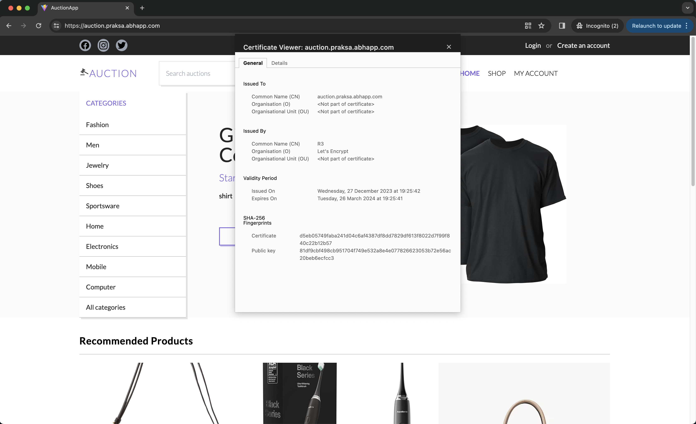

# Collaboration

## Task

QA intern needs ability to deploy application to local environment for the purposes of testing. This application is from DEV intern.

Task: 
- `Sync` with DEV intern with details how application works 
- Setup `Dockerfiles` for FE & BE application -> [Dockerfile.backend](./Dockerfile.backend), [Dockerfile.frontend](./Dockerfile.frontend)
- Prepare `docker-compose.yml` for easier deployment -> [docker-compose.yml](./docker-compose.yml)

## Setup local environments and database

Cloned Developer's app from `https://github.com/EmirKapic/AuctionApp`. I engaged in a synchronous meeting with both the developer and QA to gain a comprehensive understanding of the details involved in the functioning of the app. The developer provided me with the essential secrets and environment variables (`application.yml` and `.env` (for the root of frontend directory)) required for the project, as well as the commands needed to build the backend and frontend components locally, ensuring a smooth and efficient development process.

```bash
#backend
$ ./mvnw spring-boot:run 

#frontend
$ npm install 
$ npm run dev 
```

The application, by default, utilizes a PostgreSQL database that I set up and populated with the provided SQL script:
```bash
$ psql -U postgres -d "auction-app" -f /Users/adinpilavdzija/Desktop/sqldump.sql
```

In the `application.yaml`, it was necessary to set the current schema for `spring.datasource.url` to "auctions":
```yaml
spring.datasource.url: jdbc:postgresql://auction-postgres:5432/auction-app?currentSchema=auctions
```

An error occurred in the database during the middle of the process. Given the nature of the auction site, each product possesses start and end date attributes. The issue arose because the end date had lapsed (older than the current date), resulting in the absence of active products and triggering a 404 error. Collaborating with the developer, we identified and successfully resolved the problem.

## Docker

I successfully created Dockerfiles for the backend, frontend, and database, configuring the connection points to ensure proper functionality. The frontend Dockerfile should incorporate the `npm run build` command, as it is specifically designed for creating an optimized production build, distinct from `npm run dev` which is intended for development and includes features such as hot module replacement. After building the images and running the containers, an error surfaced during the `npm run build` process in the frontend Dockerfile:

```bash
src/pages/LandingPage/SpecialOffers/SpecialOffers.tsx:3:32 - error TS6133: 'useMemo' is declared but its value is never read.
3 import { ReactNode, useEffect, useMemo, useState } from "react";

src/components/Common/TaskBar/TaskBarItem.tsx:16:17 - error TS6133: 'e' is declared but its value is never read.
16       onClick={(e) => props.onClick()}
...
```

The error indicates unused declarations of various imports in the designated TypeScript files, requiring either their removal or optimization of the code to address the issue during the build process.

For both this issue and the database error, I utilized the `docker exec -it container_name sh` command to delve into the containers and actively troubleshoot the problems at hand.

## Docker-compose

After successfully launching the containers, the next step involved crafting a `docker-compose.yml` file to streamline the deployment and management processes, enabling a more efficient orchestration of the entire application stack.

## vite.js and .env

An error occurred when using environment variables provided in `docker-compose.yml` instead of the `.env` file. The specific issue is following: `GET https://auction.praksa.abhapp.com/undefined/categories 404 (Not Found)`.

Vite uses `dotenv` to load additional environment variables from the following files in your environment directory:
```bash
.env                # loaded in all cases
.env.local          # loaded in all cases, ignored by git
.env.[mode]         # only loaded in specified mode
.env.[mode].local   # only loaded in specified mode, ignored by git
```

`.env` files are loaded at the start of Vite. Restart the server after making changes.

To ensure that environment variables are not leaked in the GitHub repository, it was necessary to set them in the `.profile` file. This helps maintain the security and confidentiality of sensitive information while preventing inadvertent exposure in the version-controlled codebase.

```bash
$ cat .profile
...

#env vars for auction app
export VITE_BACKEND_URL=***
export VITE_FIREBASE_API_KEY=***
export POSTGRES_USER=***
export POSTGRES_PASSWORD=***
export DB_URL=***
export JWT_KEY=***
export STRIPE_SECRET_KEY=***
```

For the frontend `.env` file, the utilization of the `envsubst` command and `.env.tpl` file was imperative to substitute environment variables. This process ensures dynamic replacement of variables with their corresponding values during the build. The template file is dynamically written out to the .env file, populating it with the necessary environment variables.

## Nginx reverse proxy and SSL certificates

It was essential to establish an Nginx reverse proxy with domains for both our frontend and backend, primarily to enhance security, improve performance, and simplify the management of incoming web traffic. This setup allows for efficient routing of requests to the appropriate services based on the specified domains. Additionally, the reverse proxy can handle tasks such as load balancing, caching, and providing an added layer of security.

After creation of Nginx configuration files, we needed to create symbolic links (symlinks) in the Nginx configuration to enable specific sites:
```bash
$ sudo ln -s /etc/nginx/sites-available/auction.praksa.abhapp.com /etc/nginx/sites-enabled/
$ sudo ln -s /etc/nginx/sites-available/auctback.praksa.abhapp.com /etc/nginx/sites-enabled/
```

The implementation of an SSL certificate using Let's Encrypt was necessary to secure the communication between clients and the server. SSL encryption ensures that data exchanged between users and the server remains confidential and secure, safeguarding sensitive information from potential unauthorized access or interception during transit. This is particularly crucial for protecting user data and maintaining the integrity of communication channels in a production environment.

SSL certificates for the domains were obtained through the utilization of Certbot:
```bash
$ sudo certbot --nginx -d auction.praksa.abhapp.com -d www.auction.praksa.abhapp.com
$ sudo certbot --nginx -d auctback.praksa.abhapp.com -d www.auctback.praksa.abhapp.com
```

Take a look at ...
  - following domains:
    - [auction.praksa.abhapp.com](https://auction.praksa.abhapp.com/)
    - [auctback.praksa.abhapp.com](https://auctback.praksa.abhapp.com/)
  - as well as the Nginx configuration files:
    - [auction.praksa.abhapp.com](./auction.praksa.abhapp.com)
    - [auctback.praksa.abhapp.com](./auctback.praksa.abhapp.com)

## Github-actions

We used GitHub Actions to implement Continuous Deployment on our internship server, ensuring that the application remains consistently up-to-date. Whenever a merge occurs on the master branch, our [`workflow (master_merge.yml)`](./master_merge.yml) is automatically triggered, and utilizing Docker Compose, it seamlessly updates the application.

## Location of the files

Repo tree or where should these files be placed:
```bash
$ tree
.
├── .github
│   └── workflows
│       └── master_merge.yml
├── backend
│   └── Dockerfile.backend
├── deployment
│   ├── .env.tpl
│   ├── docker-compose.yml
│   └── init.sql
└── frontend
    └── Dockerfile.frontend
```

```bash
$ ls -l /etc/nginx/sites-available/
total 20
-rw-r--r-- 1 root root 1143 Dec 27 23:39 auctback.praksa.abhapp.com
-rw-r--r-- 1 root root 1135 Dec 29 10:03 auction.praksa.abhapp.com

$ ls -l /etc/nginx/sites-enabled/
total 0
lrwxrwxrwx 1 root root 53 Dec 30 18:25 auctback.praksa.abhapp.com -> /etc/nginx/sites-available/auctback.praksa.abhapp.com
lrwxrwxrwx 1 root root 52 Dec 29 10:04 auction.praksa.abhapp.com -> /etc/nginx/sites-available/auction.praksa.abhapp.com
```

## Screenshot

