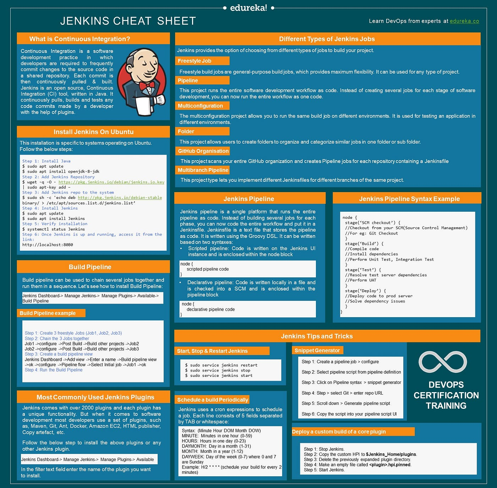
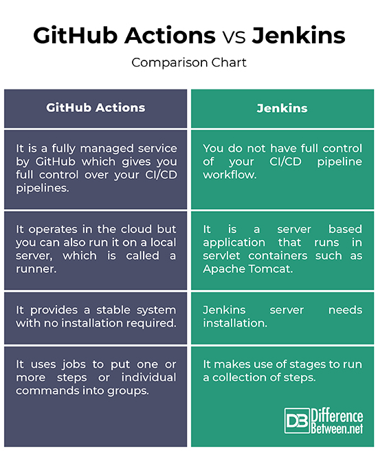

# Prepare local Jenkins deployment for QA collaboration

## Task

Task: Prepare local Jenkins deployment for QA collaboration

DEV's app: https://github.com/EmirKapic/AuctionApp
QA's tests: https://github.com/ajlasisic/auction_app_tests

## Resources

- [Learn Jenkins! Complete Jenkins Course - Zero to Hero](https://youtu.be/6YZvp2GwT0A?si=GMaWWZU_Qqetsv2a)
- [Complete Jenkins Pipeline Tutorial | Jenkinsfile explained](https://youtu.be/7KCS70sCoK0?si=UbdnAFhzZZ_5vFwk)

## Jenkins cheatsheet



## Jenkins vs GitHub Actions



## Jenkins

<p align="center">
  
</p>

Jenkins is an open source continuous integration/continuous delivery and deployment (CI/CD) automation software DevOps tool written in the Java programming language. It is used to implement CI/CD workflows, called pipelines.

Pipelines automate testing and reporting on isolated changes in a larger code base in real time and facilitates the integration of disparate branches of the code into a main branch. They also rapidly detect defects in a code base, build the software, automate testing of their builds, prepare the code base for deployment (delivery), and ultimately deploy code to containers and virtual machines, as well as bare metal and cloud servers. There are several commercial versions of Jenkins. This definition only describes the upstream Open Source project.

Over time, continuous delivery and deployment features have been added to Jenkins. In both cases, automation reduces the number of errors that occur because the correct steps and best practices are encoded into Jenkins. 

Jenkins runs as a server on a variety of platforms including Windows, MacOS, Unix variants and especially, Linux. More recently, Jenkins has been adapted to run in a Docker container. 

### Piepeline

To operate Jenkins, pipelines are created. A pipeline is a series of steps the Jenkins server will take to perform the required tasks of the CI/CD process. These are stored in a plain text Jenkinsfile. The Jenkinsfile uses a curly bracket syntax that looks similar to JSON. Steps in the pipeline are declared as commands with parameters and encapsulated in curly brackets. The Jenkins server then reads the Jenkinsfile and executes its commands, pushing the code down the pipeline from committed source code to production runtime. 

### Plugins

A plugin is an enhancement to the Jenkins system. They help extend Jenkins capabilities and integrated Jenkins with other software. Plugins can be downloaded from the online Jenkins Plugin repository and loaded using the Jenkins Web UI or CLI. Currently, the Jenkins community claims over 1500 plugins available for a wide range of uses. A plugin is written in Java. Plugins use their own set of Java Annotations and design patterns that define how the plugin is instantiated, extension points, the function of the plugin and the UI representation in the Jenkins Web UI. 

Plugins help to integrate other developer tools into the Jenkins environment, add new user interface elements to the Jenkins Web UI, help with administration of Jenkins, and enhance Jenkins for build and source code management. One of the more common uses of plugins is to provide integration points for CI/CD sources and destinations. These include:
- software version control systems (SVCs) such as Git and Atlassian BitBucket, 
- container runtime systems - especially Docker, 
- virtual machine hypervisors such as VMware vSphere, 
- public cloud instances including Google Cloud Platform and Amazon AWS, 
- private cloud systems such as OpenStack,
- plugins that assist in communicating with operating systems over FTP, CIFS, and SSH.

### Advantages and disadvantages

Advantages:
- plugins enhance the extendibility and flexibility of Jenkins,
- it's highly unopinionated, so it fits well into most environments, including complex hybrid and multi-cloud systems,
- broad knowledge base, extensive documentation, and abundant community resources

Disadvantages:
- production Jenkins can be difficult to implement,
- the open source system is also a single server architecture, so it doesn't allow for federation across servers resulting in performance issues,
- it relies on older Java architectures and technology, specifically servlets and Maven

## Installation

Jenkins can be installed using the [Homebrew package manager](https://www.jenkins.io/download/lts/macos/). Homebrew formula: `jenkins-lts`.

Sample commands:
```bash
$ brew install jenkins-lts #Install the latest LTS version
$ brew services start jenkins-lts #Start the Jenkins service
$ brew services restart jenkins-lts #Restart the Jenkins service
$ brew upgrade jenkins-lts #Update the Jenkins version
```

After starting the Jenkins service, browse to `http://localhost:8080` and follow the instructions to complete the installation. Also see the external materials for installation guidelines. For example, this blogpost describes the installation process.

## Setting required plugins

In addition to the recommended plugins, it was necessary to install the [NodeJS Plugin](https://plugins.jenkins.io/nodejs/). It was also needed to set it up: Dashboard - Manage Jenkins - Tools - NodeJS installations - Add NodeJS - Name: `NodeJS` - Check Install automatically - `Install from nodejs.org` - Version: `NodeJS 21.5.0` - Global npm packages refresh hours: `72`.

In the Build Triggers section, the `Build periodically` option offers a cron-like feature to periodically execute this project. While this feature can be likened to a cron replacement and is commonly used for scheduled builds such as nightly or weekly, it may not align optimally with the continuous integration philosophy. The point of Continuous Integration is to start a build as soon as a change is made, to provide a quick feedback to the change. To achieve this, it is recommended to establish a connection between Source Code Management (SCM) change notification and Jenkins, so we use `Poll SCM` option.

`Scripted pipeline` is a way to define continuous delivery pipelines using a Groovy-based DSL (Domain-Specific Language). Jenkins Pipeline is a suite of plugins that allows you to define and manage Jenkins jobs using code, and the scripted pipeline is one of the two main ways to create pipelines in Jenkins—the other being the `Declarative Pipeline`.

## Understanding the scripted pipeline and its key parts

Basic scripted pipeline in Jenkins typically consists of several parts that define the stages, steps, and other configurations for your CI/CD process. Below are defined the essential parts of my scripted pipelines:

- [Build pipeline](./build) 
```groovy
pipeline { //Pipeline block is the starting point for your scripted pipeline
    //Agent Section specifies where the pipeline will be executed. It can be defined at the top level or within each stage. This is the top-level definition
    agent any //running this pipeline on any available Jenkins agent

    tools { //Tools Section is used to define or configure various tools or dependencies required for the execution of a particular process. This could include setting up the environment, specifying versions of software, or configuring other resources.
        nodejs "NodeJS" //using NodeJS tool named "NodeJS"
    }

    environment { //Environment section is place where environment variables can be defined so they could be available to all steps within the pipeline.
        CI = "true" //set environment variable CI to "true"
    }

    stages { //Stages block is used to define the different stages of your pipeline. Each stage typically represents a phase in your build, test, or deployment process.
        
        stage('Checkout app repo') { //Stage section is used to define logical divisions or phases within a pipeline. It allows you to organize and structure your pipeline into distinct steps, making it easier to understand and manage the workflow. 
            steps { //Within each stage are defined the individual steps that need to be executed. Steps can include build commands, testing, deployment, etc.
                git 'https://github.com/adinpilavdzija/auction' //clone the app repository from the specified URL
            }
        }
        
        stage('Build Backend') {
            steps {
                sh 'cd backend && ./mvnw clean package' //change directory to "backend" and build using Maven
            }
        }
        
        stage('Build Frontend') {
            steps {
                sh 'cd frontend && npm install && npm run build' //change directory to "frontend", install npm dependencies, and then build
            }
        }
    }
}
```


- [regression_test pipeline](./regression_test) is the identical pipeline utilized for both [smoke_test](./smoke_test) and [api_test](./api_test), with the sole distinction lying in the different `npx wdio` commands used:
```groovy
pipeline {
    agent any

    tools {
        nodejs "NodeJS"
    }

    environment {
        CI = "true"
    }

    stages {

        stage('Checkout test repo') {
            steps {
                git branch: 'main', url: 'https://github.com/user/tests' //clone the test repository from the specified URL and branch
            }
        }

        stage('Regression test') {
            steps {
                sh 'npm install && npx wdio wdio.conf.js --spec ./ui_tests/specs/regression.spec.js' //install npm dependencies and run regression tests using WebDriverIO
            }
        }
    }
}
```

### Other common parts of scripted pipeline

- **Post Section:** The `post` section allows you to define steps that should be executed after all the stages or after specific stages. Commonly used for cleanup tasks or notifications.
```groovy
post {
    success {
        // Actions to perform on successful completion
    }
    failure {
        // Actions to perform on failure
    }
    always {
        // Actions to perform always, regardless of success or failure
    }
}
```

- **Parallel Execution:** If you have multiple tasks that can run concurrently, you can use the `parallel` block.
```groovy
stage('Parallel Build') {
    parallel {
        stage('Build A') {
            steps {
                // Build A steps
            }
        }
        stage('Build B') {
            steps {
                // Build B steps
            }
        }
    }
}
```

- **Input:** You can use the `input` step to pause the pipeline and wait for manual input before proceeding.
```groovy
stage('Manual Approval') {
    steps {
        input 'Proceed with deployment?'
    }
}
```

These are some of the fundamental components of a Jenkins scripted pipeline. Depending on your requirements, you might include additional features, such as custom functions, external library imports, or specific plugins for integrations.